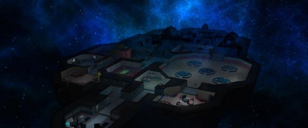
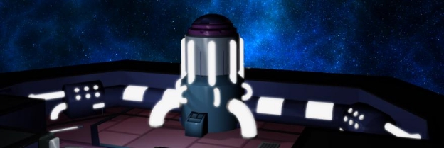

# Entre Nosotros 3D

## Módulo Taller

[ Ignacio Bianchi](https://www.linkedin.com/in/ignacio-bianchi-4355061a2/)
&nbsp;

[ Santiago Curi](https://www.linkedin.com/in/santiago-curi/)
&nbsp;

[ Gustavo Audi](https://www.linkedin.com/in/gustavo-audi-rouco-1135a110a/)
&nbsp;

## Configuración del ambiente

Para correr la solución, es necesario tener instalado una versión de [Microsoft Visual Studio](https://visualstudio.microsoft.com/es/downloads/) en Windows.

- Abrir la solución **AmongUS_CGA.sln** que se encuentra dentro de la carpeta **EntreNosotros3D**
- En la barra de herramientas, elija Release en el cuadro de lista Configuraciones de soluciones.

  
- Ejecutar la solución dando click en 'Depurador local de Windows'.
- Disfrutar del juego.

# Introducción

El presente trabajo se trata de una aplicación de visualización de un entorno 3D en tiempo real basado en el juego “Among Us”. Among Us es un juego multijugador en 2D situado en una nave espacial. Los jugadores toman el rol de sus tripulantes, debiendo realizar tareas (minijuegos) para mejorar el funcionamiento de la misma. Dentro de los jugadores existen los llamados “impostores” los cuales a priori parecen ser tripulantes ordinarios, con la diferencia de que su misión es eliminar al resto sin ser descubiertos. El juego finaliza una vez que todas las misiones hayan sido completadas, o que todos los tripulantes hayan sido eliminados.

Este proyecto es la continuación de una iteración previa con los fundamentos ya implementados de la infraestructura de navegación y movimiento, y técnicas de visualización. Se hizo énfasis en implementar gran parte de la interacción con el mundo, minijuegos y reglas de asignación de misiones y victoria, además de mejoras visuales pendientes.

# Trabajo previo

Se describen a continuación gran parte de las funcionalidades implementadas en la entrega previa del proyecto.

## Stateful cam (Free movement & Rotation)

El juego cuenta con una cámara controlada por el ratón, con lógica basada en persistencia de estados para reducir el costo de polling. Se cuenta con dos modos de movimiento:

- Modo “Jugador”, centrado en el modelo del personaje principal, cuyo desplazamiento (en el plano y=0.3, altura fija) se controla con las teclas A,S,D,W.
- Modo “FreeCam”, desligado del personaje, con desplazamiento controlado por las teclas A,S,D,W y altura controlada por Space, LCtrl.

Los modos se alternan con el menú de opciones implementado en esta iteración, accesible con la tecla ‘p’. El desplazamiento en ambos modos duplica su velocidad al presionar LShift.

## Time-based logic

Para cada generación de frame se computa el tiempo transcurrido en ticks. Las funcionalidades sensibles al tiempo se implementaron en función de este valor, buscando mantener constante la duración/velocidad independientemente de las especificaciones del sistema.

Algunas de las funcionalidades son:

- Encendido, apagado y parpadeo de luces
- Movimiento de las cámaras
- Desplazamiento del personaje
- Reproducción del sonido
- Movimiento de modelos animados
- Duración de mensajes en en pantalla (Nuevo)
- Fadeout del menú y Slide-in de minijuegos (Nuevo)

## Mesh collision detection & response

Se implementa en la clase “Model” una función de colisión, que dado un triángulo en el espacio, retorna si existe intersección con la esfera de radio 0.2 centrada en la posición del observador (con leve desplazamiento en el eje Z).

Octree (collision acceleration) + Axis-Aligned Bounding Box

Para acelerar la consulta de colisiones (el cómputo lineal era inviable, incluso simplificando las colisiones para comparar únicamente con la AABB de cada malla, la degradación era de 120 a 5fps), se utilizó una estructura de aceleración espacial Octree, con funcionalidades de almacenamiento y consulta de tipos estándares en el espacio de coordenadas enteras positivas. El mapeo utilizado lleva cada punto en el espacio al octante asociado al valor absoluto de cada coordenada redondeada (Ej: x: 1.2, y: -12.76, z: 2.2 mapea al octante x: 1, y:13, z:2).

Debido a que algunos polígonos eran muy grandes, asociar un polígono al octante correspondiente a cada uno de sus vértices no era suficiente, ocasionando “huecos” intermedios. Para evitar esto, se calcularon los volúmenes acotantes alineados a los ejes y se iteró en el rango entero correspondiente, añadiendo el polígono problemático a todos los octantes en el intervalo.

## Assimp model parsing

Se resolvió la integración de la librería Assimp para el cargado de modelos y animaciones. La clase “Model” mantiene una colección de objetos “Mesh”. En esta última se persiste la información de cada objeto en la escena parseado con Assimp (vértices, índices, texturas, materiales, y bone\_weight).

## Shading (Ambient + Diffuse + Specular + Emissive).

Cada malla tiene asociado un material con valores de cada coeficiente, y se utilizan en el fragment shader para la computación de sombreado a partir de las colecciones de luces en la escena. El valor final de cada coeficiente depende del tipo de luz (descrito a continuación), de su posición relativa, color, y características particulares de la fuente. Los componentes ambiente y emisivo dependen de cada objeto y son independientes de las colecciones de luces. La emisión se observa en los objetos con pantallas, particularmente al apagar las luces con la tecla ‘x’.

## Lights (Point, Spot & Directional)

Se implementan luces puntuales omnidireccionales, luces “Spot” con emisión en forma de cono, y luces direccionales con emisiones paralelas. Se cuenta con dos colecciones de luces que se procesan en el fragment shader “model\_loading”.

Pueden observarse luces puntuales en las salas principales, luces de foco en los pasillos, y

luces direccionales en la linterna del observador.

## Dynamic lighting (On & off, color switching, lantern)

Para activar la luz dinámica (que simula ser la linterna del personaje) cuya posición se encuentra en el observador se debe presionar la tecla “L”. A su vez apretando la tecla “X” se apagan todas las luces de la escena a excepción de las de emergencias situadas en uno de los pasillos de la nave, que continúan parpadeando de forma progresiva.

## Gloss mapping (From greyscaled texture)

Debido a que el modelo no cuenta con texturas de Gloss Mapping, y para evitar el costo asociado a realizarlas, se decidió implementar esta técnica a partir de la textura difusa de los polígonos convertida a escala de grises. El criterio es análogo al Gloss Mapping tradicional, por lo que las regiones más oscuras de la textura tienen menos brillo que las claras.

En la imagen a continuación se observa el reflejo sobre el piso interrumpido en la textura oscura.

## Spatial sound (360°, proximity scaled)

Se utilizó la biblioteca Irrklang para la implementación de sonidos. Los mismos tienen escalado por proximidad a la fuente, y distribución basada en la orientación del observador (360 grados, con balance estéreo).

## Skybox

La escena comienza renderizando una caja de 1 unidad de lado, sobre la que se mapea la textura de la skybox, en un shader independiente que no incluye shading. De esta forma es posible renderizar el fondo de la skybox para que funcione correctamente con el alpha Blending.

## Alpha blending (textures & materials, sorted blending)

Cada material tiene un valor de “Dissolve” (Siendo 1 completamente transparente, y 0 completamente opaco). Para el renderizado de transparencias, se ordenaron las mallas de forma que las opacas se renderizan en primer lugar, y posteriormente las que tengan algún nivel de transparencia. Esto funciona tanto para materiales como para texturas con canal alpha.

## Animations (skeletal)

La animación esqueletal o animación basada en huesos es una técnica la cual separa el objeto animado en dos principales componentes: La superficie del objeto y un conjunto de huesos (“bones”) interconectados. Estos huesos están alineados a ciertos vértices o zonas del objeto y tienen un peso (“weight”) que determina qué tanto se transforma la superficie de la malla a partir del movimiento de los huesos.

## Alpha LOD

Se implementó una función rudimentaria de Level of Detail, en la cual el modelo incrementa en transparencia en función de su distancia al observador. En conjunto con la funcionalidad de oscurecimiento de Fog, esto da una sensación bastante coherente de “desvanecimiento en el espacio”. Una vez superado un umbral de distancia, el modelo deja de renderizar.

## Distance Fog

De forma análoga al Level of Detail, el color del fragmento en el shader es oscurecido en función de su valor de profundidad en el z-buffer. Observamos que para el correcto funcionamiento no puede modificarse el z-buffer manualmente.

# Algoritmos y técnicas implementadas

Se describe en esta sección el conjunto de funcionalidades implementadas en el contexto de este módulo de taller.

## Bloom

Es una técnica para simular artefactos ópticos que se producen en las cámaras reales en fuentes de luz intensas. El bloom es un efecto de post-procesamiento para lograr brillo en fuentes de luz o cualquier objeto con un componente emisivo (Ej. monitores). Existen varios algoritmos que de diversas maneras buscan generar este efecto. Nuestra implementación hace un primer recorrido de la escena y guarda en dos buffers diferentes los colores propios de la escena y aquellos fragmentos que excede cierto umbral de brillo. A este último se le hace un proceso de difuminado llamado “blur”. Para lograr dicho proceso se utilizó el filtro Gaussiano de dos pasos con la implementación de ping-pong framebuffers, estos son un par de buffers usados para alternar e ir afectando la imagen de brillos con distinto efecto.Observar en la siguiente imagen.

Una vez finalizado el proceso de blur, se combina el resultado con los valores de la escena original generando así nuestra imágen final renderizada en la pantalla. En las figuras se observa el reactor sin y con el efecto de bloom.

## Sombras

Para simular la existencia de sombras estáticas en la escena se utilizó la técnica “Shadow mapping”. La idea es renderizar la escena desde el punto de vista de la fuente de luz generadora de la sombra deseada. Mediante este pasaje se guardan los valores de profundidad de cada fragmento visible en una textura llamada depth map o shadow map. Finalmente estos valores de profundidad son utilizados por el shader que realiza los cálculos de todas las luces de la escena, para así multiplicando los componentes difusos y especulares, obtener que un fragmento no sea completamente negro en caso de encontrarse detras de un objeto.

## AntiAliasing

El Anti-Aliasing es un filtro de postprocesado, y que por tanto se realiza después de generar la imagen, el cual suaviza estos dientes de sierra de manera que las líneas que no son verticales u horizontales parezcan más homogéneas, eliminando o al menos mitigando este efecto de escalones. Se utilizaron frame buffers de muestreos múltiples (en donde se realiza el renderizado de la imágen final) para llevar a cabo esta funcionalidad.

A continuación se representa el antes y el después del antialiasing.

## HUD estáticos

Se implementó la superposición de imágenes 2D en la escena para resolver múltiples escenarios de interacción con el mundo y con la pantalla. Algunas de las aplicaciones de esta funcionalidad son:

- Menú principal con opción “Jugar” interactiva.
- Mini mapa que muestra la posición actual del jugador en la nave y la ubicación de las misiones asignadas aleatoriamente.
- Botón “Usar” que se muestra cuando el jugador se encuentra en una posición interactuable (donde puede realizar una tarea) con el botón ‘F’.
- Mini juegos “Cables” y “TwoFactor”, con generación de imágenes 2D dinámicas basadas en la posición del cursor.
- Pantallas de victoria cuando el jugador completa todas las tareas disponibles; derrota y muerte cuando el jugador es alcanzado por el fantasma.
- Menú de opciones interactivo para activar/desactivar las funcionalidades.

## Texto en pantalla

Para renderizar texto en pantalla como es el caso de los fps se utiliza la librería SDL\_ttf. Dicha librería dibuja el texto en una textura SDL\_Surface y luego se utiliza los píxeles de la misma para crear textura GL\_TEXTURE\_2D y renderizarla mediante la función renderQuad. Ejemplos de esta técnica se observan en el contador de FPS en la esquina superior izquierda de la pantalla, en los números del Two-Factor, en el texto de ‘Tarea Completada!’, entre otros.

## Minimapa con posición dinámica

Se implementa un minimapa utilizando una textura generada a partir de la proyección vertical del modelo de la escena. El tamaño del mapa puede alternarse con la tecla ‘m’. En la versión extendida, se muestra la posición de las misiones asignadas aleatoriamente al comenzar una nueva partida, y en ambos mapas se renderiza un punto rojo que muestra la posición actual del personaje jugador en el mapa.

Para el cómputo de la posición de este último es necesario realizar dos transformaciones lineales del sistema de coordenadas:

- La primera convierte la coordenada en el espacio en el plano Y=0.3, a una coordenada en pantalla en el rango X=[0, SCR\_W] e Y=[0, SCR\_H]. Esta transformación intermedia es necesaria debido a que las coordenadas en pantalla se obtienen de la posición del cursor, y se mide en términos de resolución.
- La segunda convierte las coordenadas del píxel en pantalla al espacio X=[-1,1] e Y=[-1,1]. Este es el sistema de coordenadas utilizado por la función de renderizado.

Las funciones que implementan este cambio de sistema de coordenadas son utilizadas para el renderizado de otros artefactos 2D en posiciones arbitrarias de la pantalla.

## Menú de opciones

Se dispone de un menú con opciones, accesible con la tecla ‘P’, que permite activar y desactivar funcionalidades implementadas. Este menú es interactivo utilizando el mouse, y la activación de cada función se alterna haciendo click sobre la misma. Las funcionalidades interactivas son Antialiasing, Bloom, Primera persona, Mapa especular, Modo libre y Sombras.

## Modo primera persona

Se implementa un modo de cámara desde el interior del modelo jugador. Esta funcionalidad es accesible desde el menú de opciones, y ofrece una experiencia más inmersiva del juego. Destacamos la visualización de la colección de luces desde el interior del cristal cóncavo que compone el modelo. En este modo se aprecia la deformación de las luces y el punto especular.

## Minijuegos

El juego cuenta con 3 minijuegos implementados, 2 de ellos interactivos. Para jugar hay que mover el personaje jugador hasta la ubicación de cada uno de ellos, y presionar ‘F’. El juego finaliza cuando todos los minijuegos asignados son finalizados (un total de 6 tareas):

- **Cables** : De un conjunto total de 5 ubicaciones, se sortean aleatoria y uniformemente 3 de ellas. El objetivo del minijuego es conectar los cables del lado izquierdo con el color correspondiente del lado derecho. Para ello, se debe hacer click izquierdo sobre el lado izquierdo del cable y arrastrar el cursor (con el clic presionado) hasta el extremo derecho correspondiente. La misión finaliza una vez que los 4 cables han sido conectados. Las permutaciones de colores de cada misión son aleatorias.

  

- Two-Factor: Hay dos misiones de este tipo en cada partida. En cada una se sortea un código aleatorio de 5 dígitos, y debe introducirse en el pad numérico, haciendo click en cada número y finalmente en el botón verde para confirmar. Si los códigos coinciden, la misión finaliza exitosamente.

  

- Scan: Esta misión se realiza en cada partida, y consiste en ir al punto de escaneo en “MedBay” (Enfermería). El jugador es escaneado por 6 segundos, durante los cuales el modelo se vuelve wireframe y rota a velocidad constante sobre la plataforma de escaneo, mientras se escucha el sonido emitido por la plataforma activada.

  

La condición de victoria se alcanza una vez que las 6 misiones fueron completadas, y se activa la pantalla de victoria correspondiente.

## Asignación aleatoria de misiones

Tanto el subconjunto de misiones de cables a realizar, como la permutación de cables de cada misión, y el código numérico utilizado en cada una de las misiones Two-Factor, son generados de forma aleatoria y cambian en cada ejecución.

## IA Básica (Fantasma)

Se implementó un NPC enemigo para reemplazar el concepto de impostor del juego original. Se trata de un fantasma, situado en la sala de electricidad. Su funcionamiento se activa cuando el jugador se posiciona dentro de un rango del mismo, y su comportamiento consiste en perseguir al jugador en línea recta, atravesando paredes, hasta alcanzarlo. Si el NPC alcanza la posición del jugador, este es asesinado y el juego finaliza en derrota. La presencia del NPC puede advertirse por medio de un sonido (grito) que se emite con fuente en el modelo del fantasma y se escala en función de la proximidad entre el NPC y el jugador.

# Diseño de la solución

La solución está compuesta por los siguientes componentes principales:

- Main.cpp:
  - El archivo main realiza un número de funciones, conteniendo desde el manejo de la ventana y eventos por parte de la librería SDL, la utilización de matrices de vista, proyección y de modelo, el orden de renderizado de la escena, los personajes y los juegos, hasta la inicialización de los componentes de luces y sonido.
- Clase mesh:
  - Almacena los vértices, texturas, materiales y “huesos” de los modelos cargados. A su vez es la encargada de cargar estos datos en los buffers que serán utilizados posteriormente por los shaders.
- Clase model:
  - Esta es la clase encargada de parsear los modelos y almacenar sus respectivas mallas, así también como inicializarlas. La implementación de Octree y detección de colisiones se realiza en esta clase, dado que mantiene todas las mallas contra las que se verifica.
- Clase shader:
  - Se encarga de empaquetar los shaders, su pasaje de memoria y otras funciones básicas. Los shaders implementados son:
    - Antialiasing
    - Bloom
    - Blur
    - Billboards (Simplemente asigna el valor del material/textura, usado para los billboards)
    - Model\_loading (Lógica de shading, transparencia y color de la escena principal)
    - Shadows
    - Skybox\_render
- Clase camera:
  - Se encarga de todos los atributos y funciones necesarias para el manejo de la cámara.
- Clase IA:
  - Se encarga de actualizar el movimiento del fantasma y detectar cuando su posición iguala la de su objetivo (en nuestro caso, la posición del astronauta). Se puede reutilizar para la creación de futuros personajes con variantes donde el mismo no atraviese objetos sino que recalcule una dirección viable hacia el objetivo.

# Librerías utilizadas

- **SDL** : Simple DirectMedia Layer (SDL) es un conjunto de bibliotecas desarrolladas en C. Proporcionan funciones básicas de gestión de ventanas, cursores, efectos de sonido y música, además de carga y gestión de imágenes. Se utilizó la versión de SDL 1.2.15 la cual se distribuye bajo la Licencia Pública General Reducida de GNU (LGPL).

- **IrrKlang** : IrrKlang es un motor de audio portable y muy sencillo de utilizar, debido a su muy sencilla API,  que permite reproducir audio de muchos tipos ya sea en 2D o en 3D (añade la posibilidad de ubicar a la fuente de sonido en el espacio y que afecte el volumen según la posición del receptor).

- **FreeImage** : FreeImage es una librería de código abierto para soportar la carga de archivos de imágenes de  formatos populares, además de ser portable.

- **Glm** : Glm u OpenGl Mathematics es una librería portable, ya que solamente se necesita un archivo header, que contiene representaciones matemáticas pensadas para su uso en aplicaciones gráficas  con OpenGl.

- **Assimp** : Open Asset Import Library es una biblioteca de importación de modelos 3D multiplataforma que  tiene como objetivo proporcionar una interfaz de programación de aplicaciones (API) común para diferentes formatos de archivos de activos 3D. Escrito en C ++ , ofrece interfaces tanto para C como para C ++.

- **SDL\_ttf** : Librería de renderizado de fuentes con formato estándar de tipos de letra escalables.

# Estados de la aplicación

Se diseñó un modelo del comportamiento del sistema con entradas y salidas basado en una máquina de estados (AFD). Se definió un conjunto de 6 estados actores en esta relación de entradas y salidas donde el renderizado de la aplicación queda sujeto al estado efectivo y sus entradas. A continuación se enumeran y describen brevemente dichos estados:

- **INIT**: En este estado se realiza la inicialización de variables que llevan al juego a su estado inicial. Esto incluye la posición del observador, de la IA, el estado de las variables booleanas, el conjunto de misiones asignadas y completadas, entre otras.
- **MAIN\_MENU**: Renderiza la pantalla principal, evitando el cómputo de la escena 3D.
- **TRANSITION**: Estado auxiliar para la transición del menú principal al juego. Consiste en un fadeout del menú y la reproducción de un sonido de inicio de juego.
- **GAME**: En este estado se renderizan todos los modelos 3D y se resuelven las interacciones con el mundo. Es el equivalente al loop principal de frames de la iteración previa del juego.
- **COMPLETED**: Se alcanza este estado una vez se completan las misiones asignadas, mostrando una pantalla de victoria y reiniciando al estado de inicialización.
- **END\_GAME**: Una vez que el estado actual es GAME y la distancia entre la IA y el jugador (camera.pos) es menor a un umbral establecido, entonces el jugador pierde la partida y el sistema transmuta al estado END\_GAME. En este estado se renderiza una textura de derrota y luego se actualiza al estado de inicialización de variables INIT.

# Velocidad de ejecución

La velocidad de ejecución, medida en cuadros por segundo (FPS) depende fuertemente de las funcionalidades activadas en un momento dado. A continuación se presenta una tabla con el valor promedio de FPS para cada técnica para una configuración de hardware especificada y una resolución fija.

|**Resolución**|**Técnica**|**FPS**|
| - | - | - |
|1024x768|Solo shading|105|
|1024x768|AntiAliasing|75|
|1024x768|Bloom|70|
|1024x768|Shadow Map|100|
|1024x768|Todo|60|
El dispositivo de referencia cuenta con:

- CPU Intel core i7-10750H 12core 2.6ghz
- RAM 32gb
- GPU NVIDIA GeForce GTX 1650 Ti

# Conclusiones

Se logró implementar un nivel mínimo de jugabilidad y varias técnicas que mejoran la calidad visual significativamente. Hubo una penalización considerable a nivel de generación de frames, en parte por algunas de las técnicas visuales implementadas pero también debido a código ineficiente. Se intentó corregir estas patologías tanto como fue posible, eliminando transformaciones de coordenadas prescindibles, utilizando productos en lugar de cocientes cuando fuera posible, etc. Aún así, por motivos de alcance del proyecto, quedaron porciones de código ineficiente sin corregir.

El resultado final cuenta con un primer estadio de jugabilidad, un buen puntapié para desarrollar una lógica de juego más compleja. Subjetivamente, destacamos un gran nivel final de ambientación, tanto en los efectos visuales como efectos de sonido. El nivel de rejugabilidad es muy limitado por la naturaleza single-player y el límite de misiones implementadas, pero es fácil escalar agregando misiones e implementando la mecánica de impostores y votación entre rondas, solucionando en gran medida esta problemática.

La gestión de arquitectura fue uno de los puntos más débiles del proceso de desarrollo, siendo prioridad la implementación de funcionalidades y comportamientos nuevos. Esto se refleja en un archivo main de tamaño desproporcionadamente mayor al resto de fuentes. Muchas de las funciones auxiliares desarrolladas, así como sus sobrecargas, pudieron componentizarse en un fuente independiente. Análogamente, los minijuegos pudieron implementarse en una clase genérica que aprovechara la infraestructura de herencia del lenguaje utilizado, facilitando el manejo solvente de variables, texturas e interacciones y su reciclado, particularmente para las tareas con repetición.

Consideramos que el resultado final dota al proyecto de un nivel de completitud considerablemente mayor, y reproduce los minijuegos originales del juego 2d con un nivel de fiabilidad destacable. Se logró explorar técnicas visuales más complejas, con necesidades particulares de manejo de buffers, y la implementación final (si bien costosa) logró resultados de cómputo sumamente superiores a las primeras aproximaciones que implementamos.

# Trabajo futuro

Dentro de las posibles mejoras a la aplicación se encuentran:

- Refactorización de la arquitectura de forma tal que el código sea más escalable y mantenible.
- Mejora en la IA. Crear un personaje más “inteligente” donde cumpla otras funciones además de persecución en dirección recta. Consideramos una iteración posible, similar en términos de cómputo y que asumimos mejor comportamiento. La idea principal consiste en computar en intervalos regulares (n frames) la dirección determinada por el jugador y la IA. Si la trayectoria no interseca con ningún objeto en la escena, se actualiza la dirección actual de la IA y se la desplaza en esa dirección. Si la trayectoria es interrumpida por algún objeto en la escena, se desplaza en la última dirección válida. De esta forma, se obtiene un NPC con detección de colisiones (que no queda atrapado contra la primera colisión detectada), con un nivel de “memoria” del último camino viable, y con capacidad de recalcular su dirección cuando hay una trayectoria más eficiente (línea recta). Esto puede componerse con una ruta preestablecida para los casos en que se llega al final de la última ruta conocida y no hay una ruta válida por la que continuar.
- Cómputo de posiciones en pantalla independiente de la resolución. Algunas de las transformaciones de coordenadas, o de las posiciones configuradas de renderizado de elementos del HUD fueron implementadas en valores absolutos, y no en términos de la resolución, impidiendo el uso de resoluciones arbitrarias.
- Cliente-Servidor distribuido multiplayer.
- Impostor/Fantasma jugable.
- Más minijuegos. Agregar variaciones a la jugabilidad de la aplicación.
- Más interacciones con el mundo, que modifiquen el modelo (ej: cerrar/abrir puertas).
- Reproducción de animaciones.
- Utilizar una mejor técnica de difuminado, en vez de Gaussian Blur.

# Referencias

Código fuente - https://github.com/GustavoAudi/EntreNosotros3D

SDL - https://www.libsdl.org/

irrKlang - https://www.ambiera.com/irrklang/

FreeImage - http://freeimage.sourceforge.net/

Glm - https://glm.g-truc.net/0.9.9/index.html

Código animaciones - https://github.com/vovan4ik123

Learn OpenGL - https://learnopengl.com/Getting-started/

Blender - https://www.blender.org

Octree - https://nomis80.org/code/octree.html

Mesh colision - https://gamedev.net/forums/topic/701749-swept-sphere-triangle-intersection/
